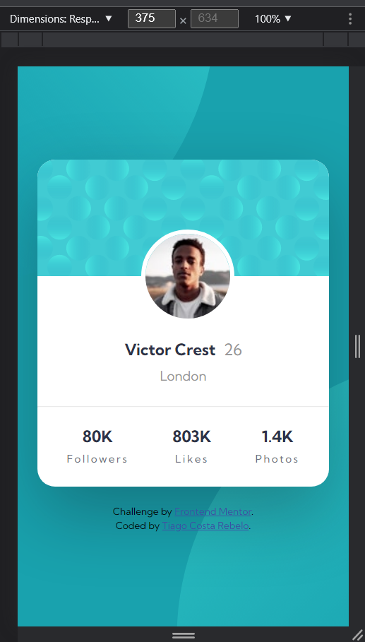
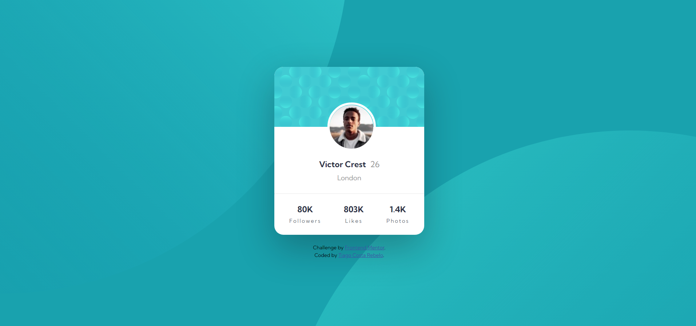

# Frontend Mentor - Profile card component solution

This is a solution to the [Profile card component challenge on Frontend Mentor](https://www.frontendmentor.io/challenges/profile-card-component-cfArpWshJ). Frontend Mentor challenges help you improve your coding skills by building realistic projects. 

## Table of contents

- [Overview](#overview)
  - [The challenge](#the-challenge)
  - [Screenshot](#screenshot)
  - [Links](#links)
- [My process](#my-process)
  - [Built with](#built-with)
  - [What I learned](#what-i-learned)
  - [Useful Resources](#useful-resources)
- [Author](#author)

## Overview

### The challenge

Users should be able to:

- View the optimal layout depending on their device's screen size

### Screenshot

### Links

- Solution URL: [Code Solution](https://github.com/tiagocostarebelo/frontendmentor_challenges/tree/main/05.profile-card-component-main)
- Live Site URL: [Live Solution](https://tiagocostarebelo-femchallenge-profilecardcomponent.netlify.app/)

## My process

First I started by rewritting the HTML, creating the necessary elements to hold everything.
After that, in mobile screen size, I styled everything.
To finalize, I switched to desktop size (1440px above).

### Built with

- Semantic HTML5 markup
- CSS custom properties
- Mobile-first workflow

### What I learned

It was challenging to get through the background and the position of the two opposite circular shapes.
I tried a few approaches but as they weren't working, I googled and I ended up in the W3Schools link bellow. It showed me that one of my initial solutions was half right. All i needed was get the background-position values right.
I was struggling, as I was only using the suggestions that linked was giving, like bottom right, top left but they were not working. 
So I went and googled if I could use different values to style the background-position. As I went for the answers, I ended up finding the MDN for that property and I reached this solution.

### Useful resources

- [W3Schools](https://www.w3schools.com/css/css3_backgrounds.asp)
- [MDN Web Docs](https://developer.mozilla.org/en-US/docs/Web/CSS/background-position)

## Author

- Website - [Tiago Costa Rebelo](https://www.tcostarebelo.design)
- Frontend Mentor - [@tiagocostarebelo](https://www.frontendmentor.io/profile/tiagocostarebelo)
- GitHub - [@tiagocostarebelo](https://www.github.com/tiagocostarebelo)
