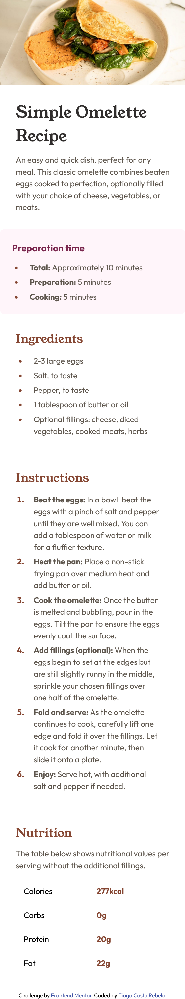
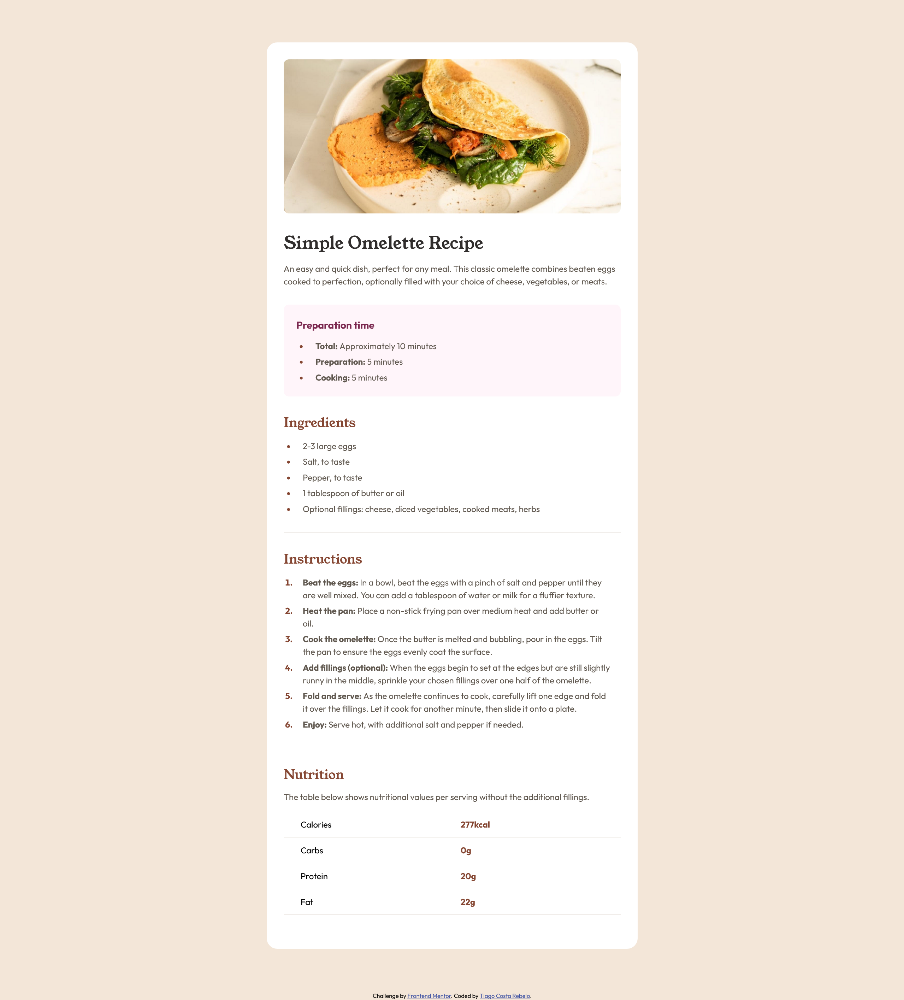

# Frontend Mentor - Recipe page solution

This is a solution to the [Recipe page challenge on Frontend Mentor](https://www.frontendmentor.io/challenges/recipe-page-KiTsR8QQKm). Frontend Mentor challenges help you improve your coding skills by building realistic projects. 

## Table of contents

- [Overview](#overview)
  - [Screenshot](#screenshot)
  - [Links](#links)
- [My process](#my-process)
  - [Built with](#built-with)
  - [What I learned](#what-i-learned)
  - [Useful resources](#useful-resources)
- [Author](#author)

## Overview

### Screenshot

### Links

- Solution URL: [Add solution URL here](https://github.com/tiagocostarebelo/frontendmentor/tree/main/07.recipe-page-main)
- Live Site URL: [Add live site URL here](https://magical-salamander-73266e.netlify.app/)

## My process

### Built with

- Semantic HTML5 markup
- CSS BEM naming convention

### What I learned

Took this chance to review some basic fundamentals of HTML structure and semantic elements and  and CSS, reinforce my usage of the BEM naming convention.

### Useful resources

- [Border in tables](https://stackoverflow.com/questions/20872200/giving-a-border-to-an-html-table-row-tr) - Usefull thread in StackOverflow on how to add border to table rows. I forgot we needed to add "border-collapse: collapse" to our table, so we can then use the border attribute to our rows.
- ["Contains" Attribute selector](https://www.impressivewebs.com/css3-attribute-selectors-substring-matching/) - I had learnt about this selector while doing Codecademy, and it's very useful to target elements that contain a specific string in their attribute value.

## Author

- Frontend Mentor - [@tiagocostarebelo](https://www.frontendmentor.io/profile/tiagocostarebelo)
- GitHub - [@tiagocostarebelo](https://www.github.com/tiagocostarebelo)

