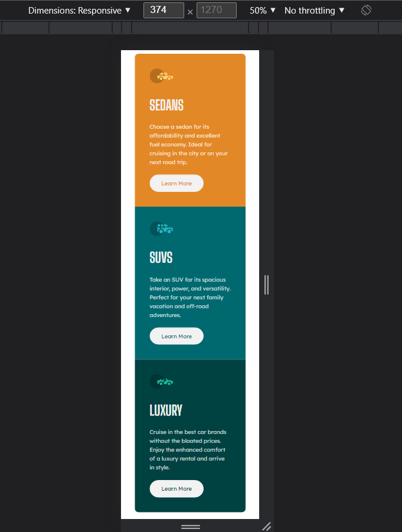

# Frontend Mentor - 3-column preview card component solution

This is a solution to the [3-column preview card component challenge on Frontend Mentor](https://www.frontendmentor.io/challenges/3column-preview-card-component-pH92eAR2-). Frontend Mentor challenges help you improve your coding skills by building realistic projects. 

## Table of contents

- [Overview](#overview)
  - [The challenge](#the-challenge)
  - [Screenshot](#screenshot)
  - [Links](#links)
- [My process](#my-process)
  - [Built with](#built-with)
  - [What I learned](#what-i-learned)
  - [Useful Resources](#useful-resources)
- [Author](#author)

## Overview

### The challenge

Users should be able to:

- View the optimal layout depending on their device's screen size

### Screenshot

### Links

- Solution URL: [Code Solution](https://github.com/tiagocostarebelo/frontendmentor_challenges/tree/main/3-column-preview-card-component)
- Live Site URL: [Live Solution](https://tiagocostarebelo-femchallenge-3columnpreviewcardcomponent.netlify.app/)

## My process

First I started by rewritting the HTML, creating the necessary elements to hold everything.
After that, in mobile screen size, I styled everything.
To finalize, I switched to desktop size (1440px above).
This time, I've included CSS Resets that I haven't in the previous solutions.

### Built with

- Semantic HTML5 markup
- CSS custom properties
- Grid
- Flexbox
- Mobile-first workflow

### What I learned

It was mostly a "remember" the basics of using Grid, but it was nice to use it again for a simple solution as this one.
Will definitely try to use it more. Along with Flexbox it makes life easier when creating layouts.

### Useful resources

- [CSS-Tricks](https://css-tricks.com/snippets/css/complete-guide-grid/)

## Author

- Website - [Tiago Costa Rebelo](https://www.tcostarebelo.design)
- Frontend Mentor - [@tiagocostarebelo](https://www.frontendmentor.io/profile/tiagocostarebelo)
- GitHub - [@tiagocostarebelo](https://www.github.com/tiagocostarebelo)
